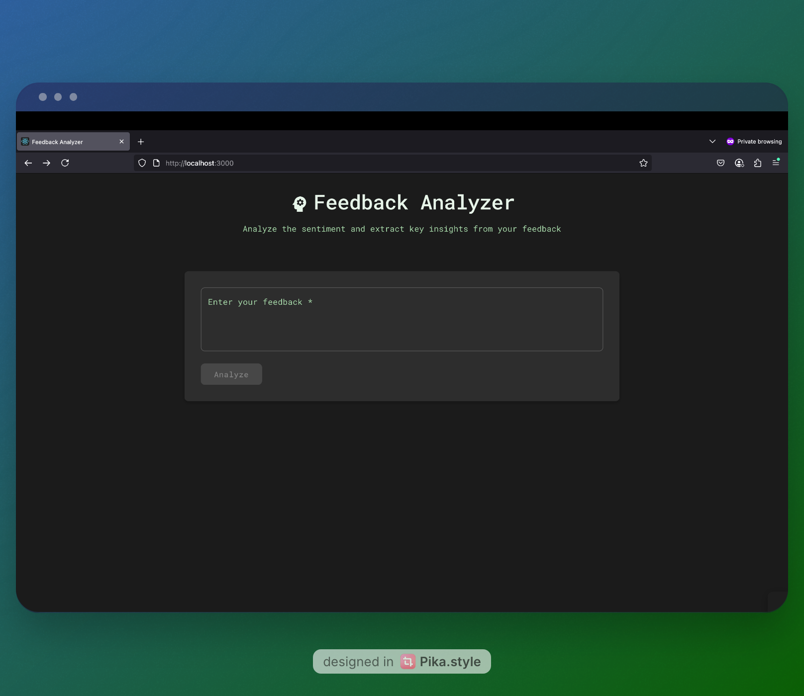
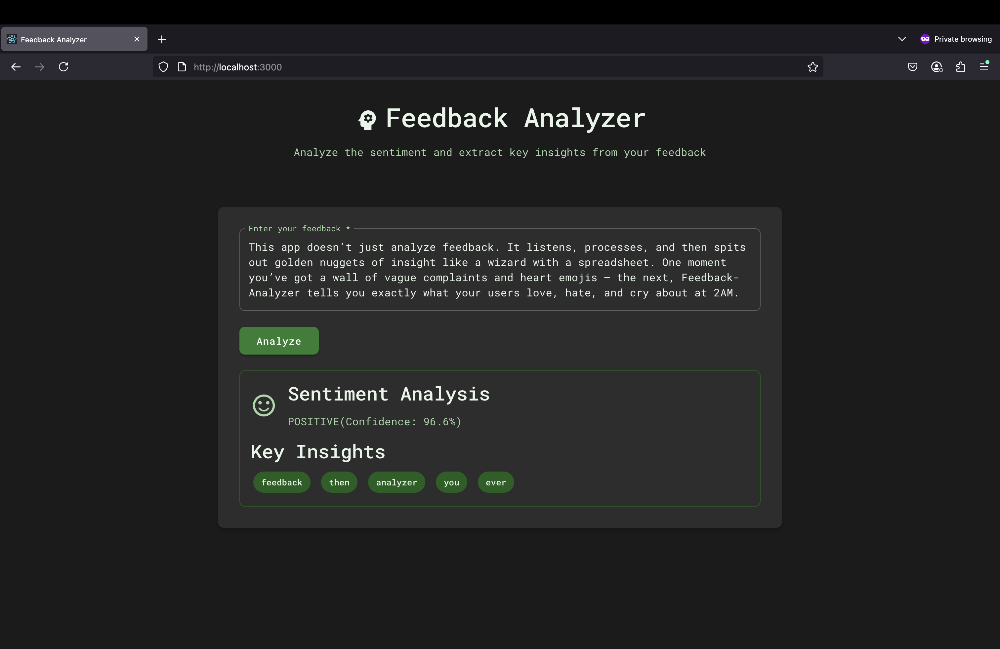

# Feedback Analyzer




A web application that analyzes user feedback by extracting sentiment and key topics. The application supports both English and Swedish text analysis.

## Features

- Sentiment analysis using Hugging Face's transformers
- Keyword extraction with support for English and Swedish stopwords
- Modern React frontend with real-time analysis
- FastAPI backend with CORS support
- Bilingual support (English and Swedish)

## Setup

### Backend Setup

1. Create a virtual environment and install dependencies:
```bash
python -m venv venv
source venv/bin/activate  # On Windows: venv\Scripts\activate
pip install -r requirements.txt
```

2. Start the backend server:
```bash
uvicorn main:app --reload
```
The backend will be available at http://localhost:8000

### Frontend Setup

1. Navigate to the frontend directory:
```bash
cd frontend
```

2. Install dependencies:
```bash
npm install
```

3. Start the development server:
```bash
npm start
```
The frontend will be available at http://localhost:3000

## API Usage

### Analyze Feedback

**Endpoint:** `POST /analyze`

**Request:**
```bash
curl -X POST http://localhost:8000/analyze \
  -H "Content-Type: application/json" \
  -d '{"text":"I really love this product. The quality is amazing and it works perfectly!"}'
```

**Response:**
```json
{
  "sentiment": {
    "label": "POSITIVE",
    "score": 0.9998793601989746
  },
  "keywords": ["really", "love", "product", "quality", "amazing"]
}
```

### Example with Swedish Text

**Request:**
```bash
curl -X POST http://localhost:8000/analyze \
  -H "Content-Type: application/json" \
  -d '{"text":"Produkten är fantastisk! Kvaliteten är utmärkt och den fungerar perfekt."}'
```

**Response:**
```json
{
  "sentiment": {
    "label": "POSITIVE",
    "score": 0.9987654321
  },
  "keywords": ["produkten", "fantastisk", "kvaliteten", "utmärkt", "fungerar"]
}
```

## Development

- Backend: FastAPI with Python 3.11+
- Frontend: React with modern JavaScript
- Dependencies are managed through `requirements.txt` (backend) and `package.json` (frontend)
- The application uses CORS to allow frontend-backend communication
- Stopwords are managed in a separate `utils.py` module for better maintainability

## Notes

- The sentiment analysis is performed using the default Hugging Face sentiment analysis model
- Keyword extraction filters out common words in both English and Swedish
- Minimum word length for keyword extraction is 3 characters
- The top 5 most frequent keywords are returned by default
- Pre-trained Model: Leverages [Sentiment Analysis by HuggingFace](https://huggingface.co/blog/sentiment-analysis-python)